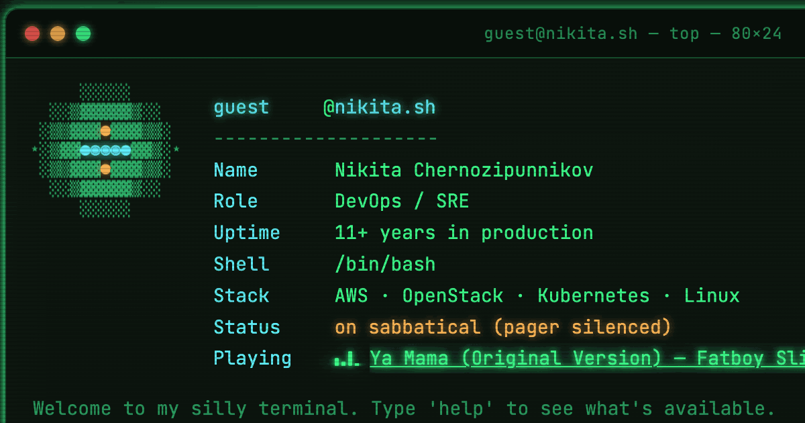

# nikita.sh

  
  
  
  

  

**[nikita.sh](https://nikita.sh)** is a DevOps/SRE portfolio dressed up
as a terminal — a playful homage, not a real shell. Type `help` once
you're in; there's more worth poking at than the obvious commands. A
proper résumé lives underneath it too (`cv.html`).

Bilingual (EN/RU), hand-authored HTML/CSS/JS with zero runtime
dependencies or build step, plus a generated plain-HTML mirror so
crawlers and AI agents that skip JavaScript still get the real content.
Everything that's actually deployed lives under `public/` — the repo
root is source/tooling only.

## What's in this repo

- the interactive terminal portfolio (`public/index.html`) and résumé
  (`public/cv.html`)
- a themed 404 page (`public/404.html`) — same terminal look, its own
  cat-themed scene, fully hand-authored
- a generated bilingual plain-HTML mirror for crawlers/LLMs (`public/llm/`)
- a small zero-dependency Node pipeline that keeps content and structured
  data in sync across all of the above from one source of truth
  (`content/`, `scripts/`)
- the `Playing` line above is fed by a separate widget backend, in its
  own repo:
  [spotify-now-playing](https://github.com/thatguynikita/spotify-now-playing)

## Docs

| Doc | Covers |
|---|---|
| **This file** | Repo layout, the bilingual `/llm/` crawler mirror, SEO/discovery notes |
| [docs/UPDATE-GUIDE.md](docs/UPDATE-GUIDE.md) | Editing content, running the build, deploying to Yandex Object Storage |
| [docs/TERMINAL.md](docs/TERMINAL.md) | What you can do in `index.html`'s terminal — commands, easter eggs, and hidden features |
| [docs/CV.md](docs/CV.md) | What's on the `cv.html` résumé page and how printing/language switching work |
| [docs/404.md](docs/404.md) | What the `404.html` error page shows visitors |

## Project structure

| Path | What it is |
|---|---|
| `public/` | Everything actually deployed — its contents map 1:1 to the site's root (`public/index.html` -> `nikita.sh/index.html`, `public/assets/...` -> `nikita.sh/assets/...`); see `scripts/deploy.mjs` |
| `public/index.html`, `public/cv.html` | The live site — hand-authored; only their `GENERATED:*` data blocks are generator-owned |
| `public/404.html` | Custom error page — fully hand-authored, no `GENERATED:*` blocks (`content/site-data.mjs` doesn't apply to it) |
| `public/theme.css`, `public/theme.js` | Shared styling/JS for all three live pages |
| `public/favicon.ico`, `public/robots.txt`, `public/site.webmanifest`, `public/sitemap.xml`, `public/llms.txt` | Deployed to the site root as `/favicon.ico` etc. — browser/crawler convention requires it, not a choice |
| `public/assets/icons/` | Favicons, apple-touch-icon, android-chrome |
| `public/assets/img/` | `nikita-photo.png`, `og-terminal.png` (OG images), `404-cat.png` (404 page art) |
| `content/site-data.mjs` | Single source of truth for shared facts (bio, socials, skills, jobs, certs, JSON-LD) |
| `scripts/` | `build.mjs` propagates `content/site-data.mjs` into `public/index.html`, `public/cv.html`, and `public/llm/*`; `deploy.mjs` pushes everything under `public/` to Yandex Object Storage |
| `public/llm/` | Plain-HTML crawler mirror (see below) |
| `docs/UPDATE-GUIDE.md` | The content-update + deploy workflow |

## Crawler mirror (`/llm/`)

`index.html` and `cv.html` are the live, JS-rendered site. `public/llm/`
is a generated plain-HTML mirror of the same content — English at
`/llm/`, Russian at `/llm/ru/` — for crawlers and AI agents that don't
execute JavaScript. It's generated from `content/site-data.mjs` by
`node scripts/build.mjs`, not hand-maintained (see `docs/UPDATE-GUIDE.md`).

| File | What it is |
|---|---|
| `public/robots.txt` | Allows named AI/search crawlers, points to sitemap |
| `public/llms.txt` | Summary + direct links, both languages |
| `public/sitemap.xml` | Lists live pages + both mirrors, with hreflang alternates |
| `public/llm/style.css` | Shared stylesheet for the mirror pages |
| `public/llm/index.html` | EN profile (about, skills, contact) |
| `public/llm/cv.html` | EN full CV (experience, education, certs, languages, skills) |
| `public/llm/ru/index.html` | RU profile |
| `public/llm/ru/cv.html` | RU full CV |

**Discovery**: `index.html`/`cv.html` never link to `/llm/` on purpose —
a JS page and a plain-HTML page serving the same content differently at
the same URL would read as cloaking to search engines. Instead
`sitemap.xml` and `llms.txt` list `/llm/` and `/llm/ru/` directly, each
EN/RU pair cross-references the other via `hreflang` (plus `x-default`
pointing at EN), and every mirror page has a visible `EN`/`RU` switcher
for anyone who lands on the wrong language.

## License

Dual-licensed:

- **Code** (the terminal engine, the content-generation pipeline, build/
  deploy tooling, page structure/styling) — [MIT](LICENSE).
- **Content** (biography, résumé text, photography, and the terminal
  persona's writing — fortunes, boot-sequence lines, easter-egg dialogue,
  and similar) — [CC BY-NC-ND 4.0](LICENSE-CONTENT). View and share with
  attribution; no commercial use, no adaptations of the persona/bio/photo
  as your own.
