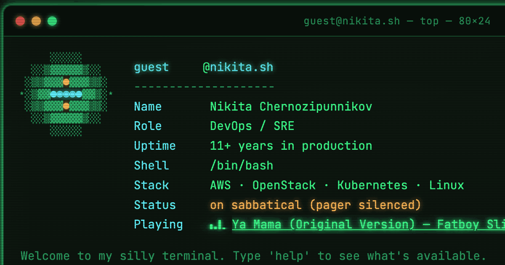

# nikita.sh

  

**[nikita.sh](https://nikita.sh)** is a DevOps/SRE portfolio dressed up
as a terminal — a playful homage, not a real shell. Type `help` once
you're in; there's more worth poking at than the obvious commands. A
proper résumé lives underneath it too (`cv.html`).

Bilingual (EN/RU), hand-authored HTML/CSS/JS with zero runtime
dependencies or build step, plus a generated plain-HTML mirror so
crawlers and AI agents that skip JavaScript still get the real content.

## What's in this repo

- the interactive terminal portfolio (`index.html`) and résumé (`cv.html`)
- a generated bilingual plain-HTML mirror for crawlers/LLMs (`llm/`)
- a small zero-dependency Node pipeline that keeps content and structured
  data in sync across all of the above from one source of truth
  (`content/`, `scripts/`)
- a Spotify "now playing" widget backend — the `Playing` line above —
  deployed separately from the static site (`spotify/`)

## Docs

| Doc | Covers |
|---|---|
| **This file** | Repo layout, the bilingual `/llm/` crawler mirror, SEO/discovery notes |
| [docs/UPDATE-GUIDE.md](docs/UPDATE-GUIDE.md) | Editing content, running the build, deploying to Yandex Object Storage |
| [spotify/SETUP.md](spotify/SETUP.md) | Standing up the now-playing widget on a VPS — systemd timer, nginx config, Spotify API setup |

## Project structure

| Path | What it is |
|---|---|
| `index.html`, `cv.html` | The live site — hand-authored; only their `GENERATED:*` data blocks are generator-owned |
| `theme.css`, `theme.js` | Shared styling/JS for both live pages |
| `favicon.ico`, `robots.txt`, `site.webmanifest`, `sitemap.xml`, `llms.txt` | Pinned to root — browser/crawler convention requires it, not a choice |
| `assets/icons/` | Favicons, apple-touch-icon, android-chrome |
| `assets/img/` | `nikita-photo.png`, `og-terminal.png` (OG images) |
| `content/site-data.mjs` | Single source of truth for shared facts (bio, socials, skills, jobs, certs, JSON-LD) |
| `scripts/` | `build.mjs` propagates `content/site-data.mjs` into `index.html`, `cv.html`, and `llm/*`; `deploy.mjs` pushes to Yandex Object Storage |
| `llm/` | Plain-HTML crawler mirror (see below) |
| `spotify/` | Now-playing widget backend — separate service, not part of the static deploy |
| `docs/UPDATE-GUIDE.md` | The content-update + deploy workflow |

## Crawler mirror (`/llm/`)

`index.html` and `cv.html` are the live, JS-rendered site. `llm/` is a
generated plain-HTML mirror of the same content — English at `/llm/`,
Russian at `/llm/ru/` — for crawlers and AI agents that don't execute
JavaScript. It's generated from `content/site-data.mjs` by
`node scripts/build.mjs`, not hand-maintained (see `docs/UPDATE-GUIDE.md`).

| File | What it is |
|---|---|
| `robots.txt` | Allows named AI/search crawlers, points to sitemap |
| `llms.txt` | Summary + direct links, both languages |
| `sitemap.xml` | Lists live pages + both mirrors, with hreflang alternates |
| `llm/style.css` | Shared stylesheet for the mirror pages |
| `llm/index.html` | EN profile (about, skills, contact) |
| `llm/cv.html` | EN full CV (experience, education, certs, languages, skills) |
| `llm/ru/index.html` | RU profile |
| `llm/ru/cv.html` | RU full CV |

**Discovery**: `index.html`/`cv.html` never link to `/llm/` on purpose —
a JS page and a plain-HTML page serving the same content differently at
the same URL would read as cloaking to search engines. Instead
`sitemap.xml` and `llms.txt` list `/llm/` and `/llm/ru/` directly, each
EN/RU pair cross-references the other via `hreflang` (plus `x-default`
pointing at EN), and every mirror page has a visible `EN`/`RU` switcher
for anyone who lands on the wrong language.

## License

Dual-licensed:

- **Code** (the terminal engine, the content-generation pipeline, build/
  deploy tooling, page structure/styling) — [MIT](LICENSE).
- **Content** (biography, résumé text, photography, and the terminal
  persona's writing — fortunes, boot-sequence lines, easter-egg dialogue,
  and similar) — [CC BY-NC-ND 4.0](LICENSE-CONTENT). View and share with
  attribution; no commercial use, no adaptations of the persona/bio/photo
  as your own.
