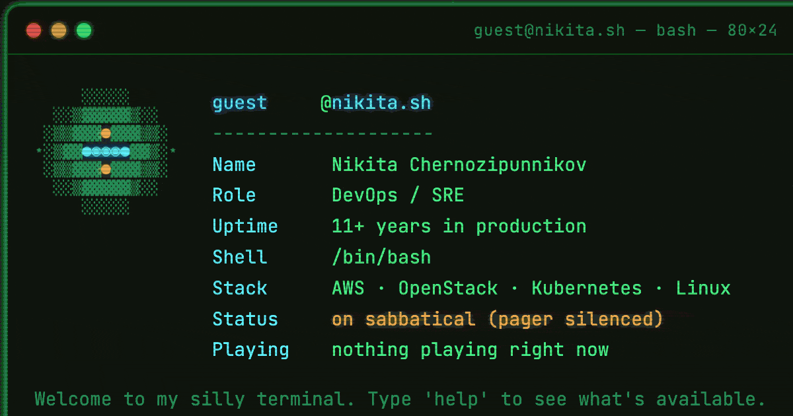

# nikita.sh

<p align="center">
  <a href="https://github.com/thatguynikita/nikita.sh/actions/workflows/ci.yml"></a>
  <a href="LICENSE"></a>
  <a href="LICENSE-CONTENT"></a>
  <a href="https://nikita.sh"></a>
</p>

<p align="center">
  
</p>

<p align="center">
  <b>A terminal portfolio with a hidden platformer, live Spotify, and seven retro themes —<br>
  that also happens to be readable by screen readers, search engines, and AI agents.<br>
  Zero dependencies.</b>
</p>

<p align="center">
  <a href="https://nikita.sh">Try it</a> · <a href="docs/SETUP.md">Make it yours</a> · <a href="docs/TERMINAL.md">What's hidden in it</a>
</p>

---

## It's a toy first

Type `help` and it will tell you about eleven commands. There are more
than twenty. That's deliberate — the site rewards poking at it:

- **`sudo ./milk-quest.sh`** opens a playable web platformer inside a
  CRT-framed window.
- **`ssh recruiter@nikita.sh`** starts an interactive Q&A that answers
  screening questions in-terminal.
- **`sudo rm -rf /`** does what you'd hope, then admits it didn't.
- **`claude "add light theme"`** starts an argument with a fake AI CLI.
  Ask twice and it builds you a hidden seventh theme.
- **`whoami`** reads your browser, OS and timezone, then makes a
  time-of-day-appropriate remark about your life choices.
- Plus a virtual filesystem with a readable `.bashrc`, 28 fortunes, and
  fake `top` / `kubectl` / `terraform` / `df` / `ps` that are all more
  detailed than they need to be.

The neofetch card's `Playing` line is real, fed by a separate
[Spotify widget backend](https://github.com/thatguynikita/spotify-now-playing).

## And an actual portfolio second

The engineering is why it's worth forking rather than just enjoying:

**It works on a phone.** The most deserved criticism of terminal
portfolios is "cute on desktop, useless on mobile — I'm not typing
commands on a touchscreen." Context-aware tappable hint chips surface
the available commands and argument completions as buttons, so the whole
site is navigable with thumbs and never needs the keyboard.

**It's legible to machines.** `llms.txt`, plain-HTML `/llm/` mirrors for
crawlers that don't run JavaScript, Content-Signals in `robots.txt`,
correct `hreflang` with `x-default`, JSON-LD, and `<noscript>` fallbacks
carrying the entire CV. A JS-only portfolio is invisible to a lot of the
web; this one isn't.

**Accessibility is actually done.** An `sr-only` `<h1>`, `aria-live`
announcements on language changes, real landmarks, labelled controls,
`prefers-reduced-motion`.

**Seven hand-tuned retro themes** with real provenance — Commodore,
Turbo Pascal, DEC VT52 amber, Solarized, Ubuntu — every one checked
against WCAG AA rather than copied on vibes. (Commodore's reference
palette came in at 2.26:1 and had to be retuned.)

**Real bilingual i18n**, or one language, or three. Every user-facing
string lives in `content/locales/`, and a missing translation fails the
build instead of printing `undefined` at a visitor.

**Zero runtime dependencies and no build step for the live pages.** The
Node pipeline that keeps facts in sync across the pages, the mirrors,
the sitemap and the JSON-LD has no npm dependencies either. `npm install`
does nothing, because there's nothing to install.

## Make it yours

```bash
npm run init      # asks a handful of questions, writes site.config.mjs
npm run build
```

Two files hold everything: **`site.config.mjs`** (where the site lives,
which languages, which features) and **`content/site-data.mjs`** (who you
are). You should never need to type your domain into an HTML file — if
you do, that's a bug worth an issue.

**Honest caveats**, because a feature that turns out to need extra setup
is worse than one that was never promised:

- The **game** is a configurable slot — `game.url` points at any
  embeddable page. `cat.nikita.sh` is just what's in the demo. Set
  `game.enabled: false` and it leaves the terminal's fiction entirely.
- **Now-playing** needs a separate backend (linked above) and is a URL in
  `content/site-data.mjs`. Point it somewhere or leave it; the card
  degrades to a static line.
- The **404 page** is only half-usable on a GitHub *project* page, because
  GitHub only serves it under `/repo/`. A user/org page or custom domain
  avoids that.

Full walkthrough, including what you're legally required to replace:
**[docs/SETUP.md](docs/SETUP.md)**.

## Licence

Two licences, and the line is probably not where you'd guess.

**MIT** ([`LICENSE`](LICENSE)) covers the code *and the entire terminal
persona* — the fortunes, the boot sequence, the fake command output, the
sudo jokes, the fake `claude` conversation, and the ssh recruiter Q&A
including its answers. That's the part worth forking, so it's yours to
adapt.

**CC BY-NC-ND** ([`LICENSE-CONTENT`](LICENSE-CONTENT)) covers only the
things that are statements about a real person: the photograph, the name,
the biography, the work history, and the résumé text. Don't ship someone
else's career as your own.

Some MIT-licensed copy still describes a specific person — the recruiter
answers, the "eleven years" jokes. You're allowed to keep them. You
shouldn't. `docs/SETUP.md` lists them.

## Docs

| Doc | Covers |
|---|---|
| [docs/SETUP.md](docs/SETUP.md) | Forking this: configuration, languages, publishing, what to replace |
| [docs/TERMINAL.md](docs/TERMINAL.md) | Every command and easter egg in `index.html` |
| [docs/UPDATE-GUIDE.md](docs/UPDATE-GUIDE.md) | Editing content, running the build, deploying |
| [docs/CV.md](docs/CV.md) | The `cv.html` résumé page — printing, language switching |
| [docs/404.md](docs/404.md) | The themed error page |
| [CLAUDE.md](CLAUDE.md) | Deep architecture notes — why things are shaped the way they are, and what has bitten people before |

## Project structure

| Path | What it is |
|---|---|
| `public/` | Everything deployed, mapping 1:1 to the site root. This boundary is also the deploy allowlist. |
| `public/index.html` | The terminal. Hand-authored; only its `GENERATED:*` blocks belong to the build. |
| `public/cv.html`, `public/404.html` | Résumé and error page, same arrangement. |
| `public/theme.css`, `public/theme.js` | Shared across all three pages. Adding a theme is one CSS block. |
| `public/llm/` | Generated plain-HTML crawler mirror — never hand-edited. |
| `content/site-data.mjs` | Who the person is: bio, skills, jobs, certs, socials. |
| `content/locales/*.mjs` | Every user-facing string, one file per language. |
| `site.config.mjs` | Where the site lives and how it's assembled. |
| `scripts/` | Build, deploy, and the three checks. Zero dependencies. |
| `tests/golden-strings.json` | Snapshot of every string, so none can vanish unnoticed. |

## Crawler mirror (`/llm/`)

`index.html` and `cv.html` never link to `/llm/` on purpose — a JS page
and a plain-HTML page serving the same content at different URLs would
read as cloaking. Discovery goes through `sitemap.xml` and `llms.txt`
instead, which list the mirrors directly, plus `hreflang` cross-links
between each language pair and a visible switcher on every mirror page.

Switch the whole thing off with `mirrors.enabled: false` and every one of
those references disappears with it.
